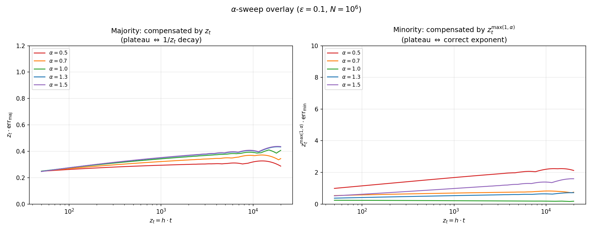
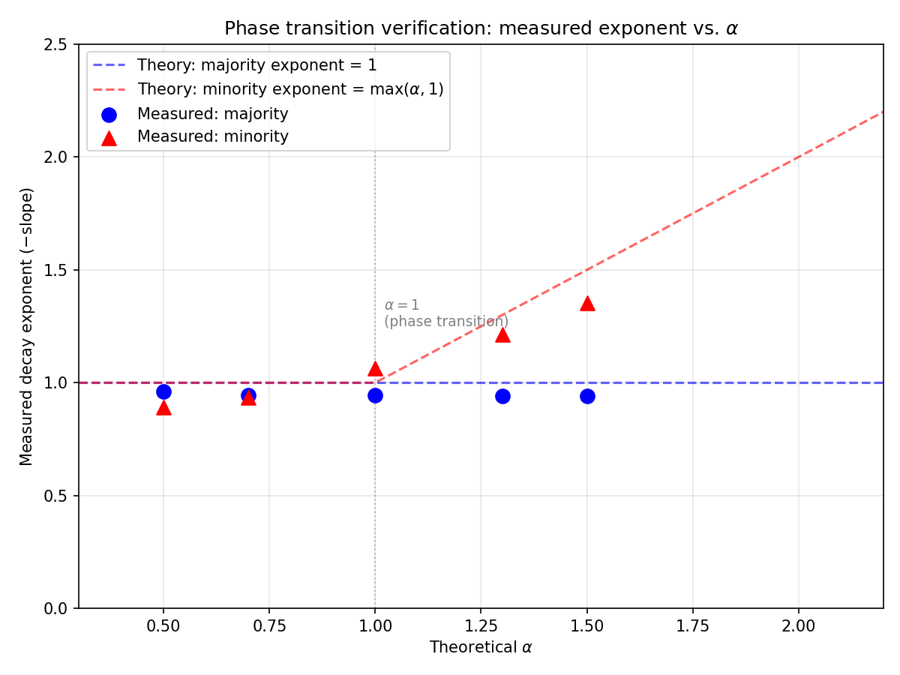

# Implicit Bias of Gradient Descent under Feature-Mediated Spurious Correlations

Theory and experiments for the per-group learning dynamics of gradient descent when the
spurious feature is entangled with the causal feature **at the instance level**.

**Boammani Aser Lompo** (École de Technologie Supérieure) · **Patrik Kenfack** (ÉTS, MILA)

📄 **[Paper (PDF)](Implicit_Bias_of_GD_under_Spurious_Correlation.pdf)** ·
🌐 **[Project page](https://aser97.github.io/Blog/Projects/Spurious-Correlation/)** ·
🧪 **[Experiments](experiments/)**

> **Status:** preprint, currently under submission.

---

## TL;DR

Group imbalance is usually blamed for the slow learning of minority groups. We show that
imbalance and **geometric margin** are competing quantities, and we characterise exactly when
each one wins.

Under feature-mediated spurious correlations, a single exponent `α` controls the competition.
There is a sharp **phase transition at α = 1**:

- **α < 1** — every group's error decays as `κ_g / (ε_g · z_t)`. The group proportion `ε_g`
  directly scales learning speed. This is the familiar "the minority is small, so it is learned
  slowly" regime.
- **α > 1** — the group with the larger causal margin **escapes the `ε`-dependence entirely** and
  converges at the faster polynomial rate `z_t^(-α)`. Group size stops governing the dynamics.

<p align="center">
  
</p>
<p align="center">
  
</p>

The practical consequence: **a minority group with a sufficient margin advantage is not doomed by
its size**, and interventions that only rebalance group proportions address just one side of the
competition.

---

## Why "feature-mediated"?

The distinction that motivates this work is *how* a spurious feature comes to correlate with the
label.

| | **Label-mediated** | **Feature-mediated** |
|---|---|---|
| Dependence | `s` depends on the label `y` only | `s` depends on the *specific value* of `r` |
| Conditional independence | `s ⊥ r \| (y, g)` holds | fails — signals entangled per instance |
| Canonical example | Waterbirds (background ↔ species via labelling) | tabular pipelines: vendor risk scores derived from raw measurements |
| Prior theory | essentially all existing analyses | **none that we are aware of** |

Because label-mediated correlations let you manipulate the causal and spurious signals
independently, they are comparatively tractable — and that is where the entire existing literature
sits. Feature-mediated correlations are both harder to detect in practice and substantially harder
to analyse.

---

## Main results

The analysis is at the **population level**: gradient descent on the expected risk under a learned
representation distribution, rather than an empirical average over a finite sample. This gives
dynamics free of finite-sample fluctuation while staying predictive of observed behaviour.

1. **Continuous-distribution implicit bias.** We generalise Theorem 9 of
   [Soudry et al. (2018)](https://arxiv.org/abs/1710.10345) to continuous, compactly supported
   distributions. The iterates still converge in direction to the max-margin classifier `ŵ`, but
   the residual grows as `−ŵ·log log t + O(1)`, versus the `O(1)` residual of the finite-sample case.

2. **Explicit per-group error rates.** In the general anisotropic case, each group's error decays as
   `Θ( z_t^(−γ_g) · (ln z_t)^(γ_g + δ_g + δ̃_g − 1) )`, governed by its hard margin `γ_g`. In the
   isotropic regime we obtain sharp asymptotics controlled by the single exponent `α`.

3. **A phase transition at α = 1** — see the TL;DR above. Confirmed empirically to be sharp.

4. **Generalisation failure under correlation shift.** Under a shift in the spurious correlation at
   test time, the classifier may reach a **non-vanishing error floor** whenever the test margin
   `γ_test < 0`. Convergence of the training dynamics buys nothing: the error does not decay to
   zero no matter how long you train.

---

## Repository contents

```
.
├── README.md
├── Implicit_Bias_of_GD_under_Spurious_Correlation.pdf   # current paper
│
├── Spurious_Training_Dynamics.ipynb                     # Colored-MNIST notebook (original study)
├── imb_utils.py                                         # dataset, backbone, GD training, plotting
├── imgs/                                                # notebook figures
│
└── experiments/                                         # experiments reported in the paper
    ├── README.md                                        # full run instructions and expected results
    ├── synth_utils.py                                   # core library: config, data, GD, theory curves
    ├── run_tabular_vendor.py                            # α-sweep  (Theorems 1 & 2)
    ├── run_tabular_vendor_eps_sweep.py                  # ε-sweep
    ├── replot_tabular_vendor.py                         # re-plot without re-running GD
    ├── build_colored_mnist.py                           # Colored-MNIST construction
    ├── train_mlp_colored_mnist.py                       # MLP with per-epoch checkpoints
    ├── train_sae_analyze.py                             # SAE decomposition + permutation test
    ├── figures/                                         # committed α-sweep figures
    ├── tabular_vendor_results/alpha_*/logs.json         # raw α-sweep logs
    └── tabular_vendor_eps_sweep_results/                # raw ε-sweep logs
```

---

## Reproducing the paper's figures

The raw `logs.json` files are committed, so the headline figures regenerate in seconds — no need to
repeat the multi-hour gradient-descent runs:

```bash
cd experiments
pip install torch torchvision numpy matplotlib scipy scikit-learn

python replot_tabular_vendor.py --T_max 20000          # α-sweep figures from committed logs
python run_tabular_vendor_eps_sweep.py --plot_only     # ε-sweep figures from committed logs
```

To re-run the experiments from scratch:

```bash
python run_tabular_vendor.py --quick                   # sanity check, < 5 min on CPU
python run_tabular_vendor.py                           # full α-sweep, ~2–4 h on an A6000
python run_tabular_vendor_eps_sweep.py                 # full ε-sweep, ~4–6 h
```

The Colored-MNIST suite (dataset is not committed — ~188 MB, rebuild it):

```bash
python build_colored_mnist.py --epsilon 0.1 --out_dir ./data_colored_mnist
python train_mlp_colored_mnist.py --data_dir ./data_colored_mnist --checkpoint_epochs 1,2,3,4,5
python train_sae_analyze.py --data_dir ./data_colored_mnist --run_all_epochs --alpha 0.03 --n_perm 1000
```

See [`experiments/README.md`](experiments/README.md) for the data model, parameter choices, expected
results and compute requirements.

---

## The original Colored-MNIST study

`Spurious_Training_Dynamics.ipynb` is the earlier, self-contained study that first verified the
imbalance dynamics: build the biased two-label dataset, pretrain a small backbone on plain MNIST,
then train a linear head with full-batch gradient descent and track per-group error decay.

```python
from imb_utils import Config, make_colored_mnist_biased, SmallBackbone, LinearHead

cfg = Config()
cfg.epsilon    = 0.01      # minority (bias-conflicting) fraction
cfg.head_lr    = 1e-2      # constant step size h
cfg.head_steps = 3_000_000 # T
cfg.out_dim    = 256
cfg.out_dir    = "./runs/colored_mnist_eps_0p01"
```

Sweep `cfg.epsilon` across runs into separate `out_dir`s, then aggregate:

```python
from imb_utils import load_all_runs, plot_1_over_t_decay, plot_speed_vs_epsilon_at_last

runs = load_all_runs("./runs")
plot_1_over_t_decay(runs, H, cfg, group="min", t_min=5e5)
plot_speed_vs_epsilon_at_last(runs, H, cfg)
```

GPU is optional — the code auto-detects CUDA. Long horizons (`T` on the order of 10⁶–10⁷ steps) are
needed to reach the asymptotic regime where the predicted rates become visible.

### Dataset construction

Each MNIST image gets a coloured background whose intensity is a deterministic function of the
digit class, with group-specific direction:

- **majority** — intensity *increases* with digit class
- **minority** — intensity *decreases* with digit class

The label is `y = 1[digit ≥ 5]`. The foreground digit is grayscale; only the background carries the
spurious signal. Because the background depends on the *value* of the causal feature rather than on
the label, this is feature-mediated by construction, with a nonlinear input-space map.

---

## Citation

```bibtex
@misc{lompo2026implicitbias,
  title  = {Implicit Bias of Gradient Descent under Feature-Mediated Spurious Correlations},
  author = {Boammani Aser Lompo and Patrik Kenfack},
  year   = {2026},
  note   = {Preprint, under submission}
}
```

## License

Released for research use. Please open an issue for questions about the experiments or the proofs.
